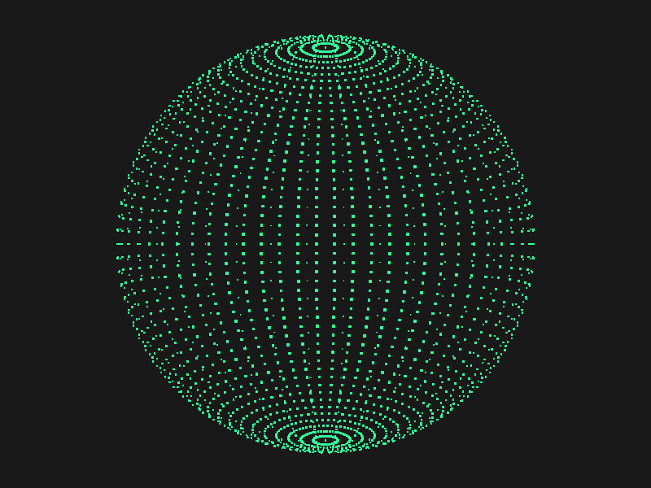
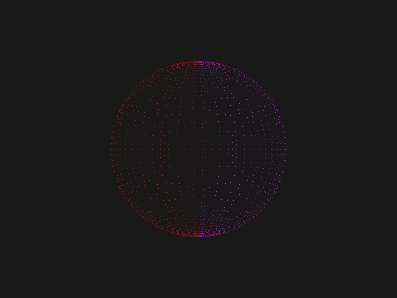
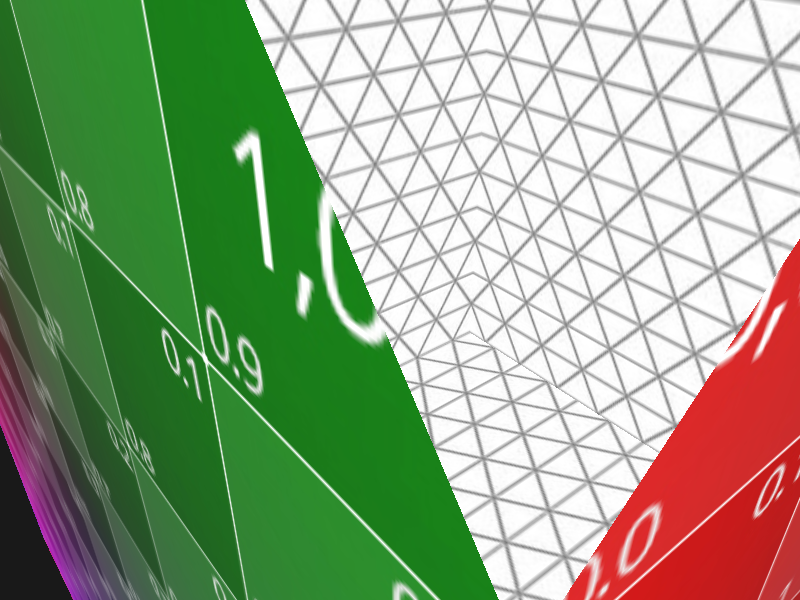

## 高级 GLSL

### 内建变量

### **顶点着色器变量**

#### gl_Position

#### gl_PointSize

渲染点的话需要启用

`glEnable(GL_PROGRAM_POINT_SIZE)`

```glsl
gl_PointSize = gl_Position.z;
```



- gl_VertexID ：输入变量，存储正在绘制顶点的当前索引

### **片段着色器变量**

#### gl_FragCoord

- x和y分量是片段窗口空间坐标，其原点为窗口的左下角
- z分量对应片段的深度值
- 只读变量，无法修改

**将屏幕分成不同颜色**

```glsl
  vec3 result = vec3(1.0);
  if(gl_FragCoord.x < 400) {
    result = vec3(1.0, 0.0, 0.0);
  } else {
    result = vec3(1.0, 0.0, 1.0);
  }
```



#### gl_FrontFacing

结果是一个bool，如果当前片段的是正向面的一部分返回true，否则是false

通过此变量显示内外显示不同的纹理

```glsl
  vec3 result = vec3(1.0);
  if(gl_FrontFacing) {
    result = texture(uvMap, oTexCoord).rgb;
  } else {
    result = texture(triMap, oTexCoord).rgb;
  }
  FragColor = vec4(result, 1.0);
```



#### gl_FragDepth

设置片段的深度值（0.0， 1.0），如果着色器没有写入值到gl_FragDepth，它会自动取用gl_FragCoord.z的值

> 深度缓冲是在片段着色器（以及模板测试）运行之后在屏幕空间中运行的

> 现在大部分的GPU都提供一个叫做提前深度测试(Early Depth Testing)的硬件特性。提前深度测试允许深度测试在片段着色器之前运行。只要我们清楚一个片段永远不会是可见的（它在其他物体之后），我们就能提前丢弃这个片段。
>
> 片段着色器通常开销都是很大的，所以我们应该尽可能避免运行它们。当使用提前深度测试时，片段着色器的一个限制是你不能写入片段的深度值。如果一个片段着色器对它的深度值进行了写入，提前深度测试是不可能的。OpenGL不能提前知道深度值。

> 如果在片段着色器中设置gl_FragDepth的值，那么OpenGL会禁用所有的**提前深度测试**，因为OpenGL无法在片段着色器运行之前得知片段将拥有的深度值，片段着色器可能会修改这个值

**OpenGL4.2可以在片段着色器顶部重新声明**

`layout (depth_<condition>) out float gl_FragDepth;`

`condition`可以为下面的值：

| 条件        | 描述                                                         |
| :---------- | :----------------------------------------------------------- |
| `any`       | 默认值。提前深度测试是禁用的，你会损失很多性能               |
| `greater`   | 你只能让深度值比`gl_FragCoord.z`更大                         |
| `less`      | 你只能让深度值比`gl_FragCoord.z`更小                         |
| `unchanged` | 如果你要写入`gl_FragDepth`，你将只能写入`gl_FragCoord.z`的值 |

通过将深度条件设置为`greater`或者`less`，OpenGL就能假设你只会写入比当前片段深度值更大或者更小的值了。这样子的话，当深度值比片段的深度值要小的时候，OpenGL仍是能够进行提前深度测试的。


